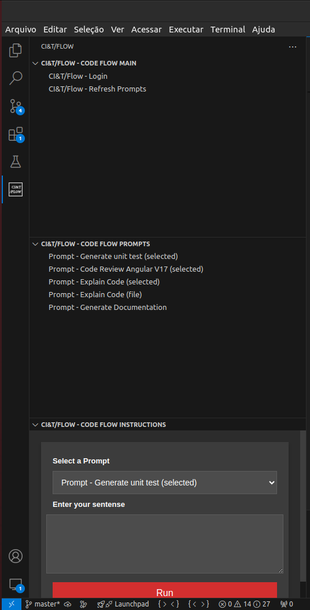

# CI&T/FLOW VSCode Extension

<br>
<br>

## Instalação - CodeFlow AI Generator

- No Vscode na aba de extensões pesquise por: `cit-code-flow-generator` ou use as extensões recomendadas deste workspace.


<br>

### Configuração

- Na sua pasta pessoal crie o arquivo prompts.yaml ex: `/home/user/dev/flow/prompts.yaml`

  

- Adicione o prompt default no `prompts.yaml`.

```sh
prompts:
- name: "Prompt - Explain Code (selected)"
  description: "Detailed Prompt to Explain the Selected Code"
  model: gpt-4o
  temperature: 0.7
  messages:
  - role: "system"
    content: |
      You are a highly experienced software engineer, responsible for explaining code in a clear and detailed manner. Your objective is to provide a comprehensive explanation of the code's functionality, logic, and structure.
  - role: "user"
    content: |
      ### Instructions:
      1. Thoroughly analyze the selected code.
      2. Provide a detailed explanation of the code's functionality and logic.
      3. Describe the purpose of each function/method, including parameters and return values.
      4. Explain key sections and logic within the code.
      5. Ensure your explanation covers the following aspects:
         - Code readability and style
         - Performance considerations
         - Security implications
         - Adherence to best practices and coding standards
         - Maintainability and scalability
      6. Provide your response in markdown format, with clear explanations for each point.


      ### Task:
      Explain the following code snippet:


      <SourceCode>
      {{selectedText}}
      </SourceCode>


- name: "Prompt - Explain Code (file)"
  description: "Detailed Prompt to Explain the Selected Code"
  model: gpt-4o
  temperature: 0.7
  messages:
  - role: "system"
    content: |
      You are a highly experienced software engineer, responsible for explaining code in a clear and detailed manner. Your objective is to provide a comprehensive explanation of the code's functionality, logic, and structure.
  - role: "user"
    content: |
      ### Instructions:
      1. Thoroughly analyze the selected code.
      2. Provide a detailed explanation of the code's functionality and logic.
      3. Describe the purpose of each function/method, including parameters and return values.
      4. Explain key sections and logic within the code.
      5. Ensure your explanation covers the following aspects:
         - Code readability and style
         - Performance considerations
         - Security implications
         - Adherence to best practices and coding standards
         - Maintainability and scalability
      6. Provide your response in markdown format, with clear explanations for each point.


      ### Task:
      Explain the following code snippet:


      <SourceCode>
      {{code}}
      </SourceCode>
```

- Use as Teclas `CTRL+P`.
- Digite >`settings.json`.
- Clique no primeiro e abra o json.


<br>
<br> 

- Adicione os itens abaixo.

```sh
"cit-code-flow-generator.pathToYamlWithPrompts": "",
```

- Em `cit-code-flow-generator.pathToYAMLWithPrompt` coloque o caminho até o seu prompts.yaml. Ex: `/home/user/dev/flow/prompts.yaml`.

- Agora abra a aba do `CI&T/FLOW` e clique em `CI&T/FLOW - Login`.

    

- Feito o login você já pode usar a extensão.

<br />
<br />
<br />
